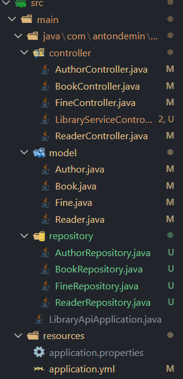
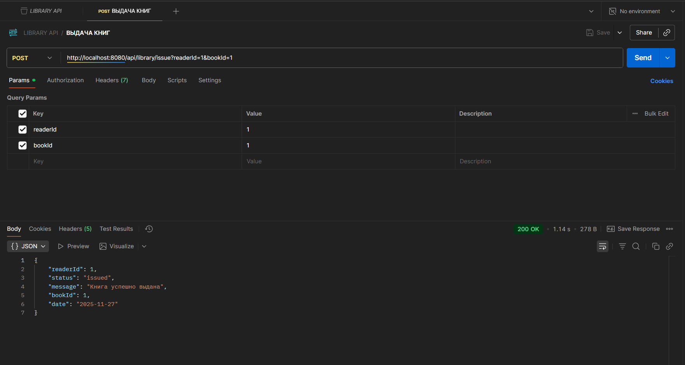
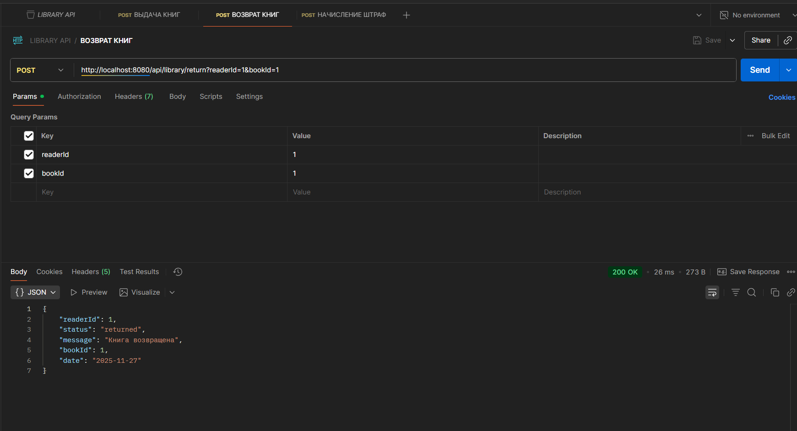
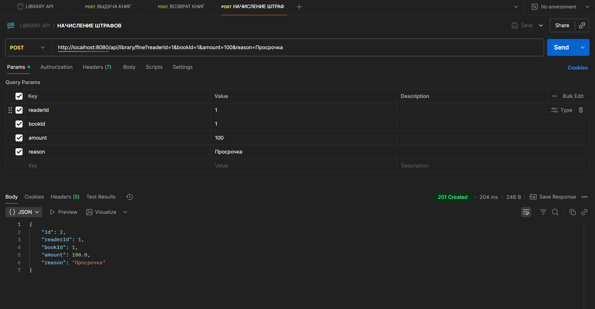

# 📚 Library API

## О проекте

Цель работы — реализовать REST‑сервис с CRUD‑операциями для сущностей **Book**, **Author**, **Reader** и **Fine**.

Я постарался сделать проект максимально воспроизводимым: от настройки зависимостей до тестирования через Postman.

---

## 🧰 Используемые технологии

- Java 21
- Spring Boot 3.5.6
- Maven
- VSCode
- Postman (для тестирования API)
- PostreSQL 16

---

## Структура проекта



_Структура проекта_

---

## Зависимости

```xml
<dependencies>
        <dependency>
            <groupId>org.springframework.boot</groupId>
            <artifactId>spring-boot-starter</artifactId>
        </dependency>

        <dependency>
            <groupId>org.springframework.boot</groupId>
            <artifactId>spring-boot-starter-web</artifactId>
        </dependency>

        <dependency>
            <groupId>org.springframework.boot</groupId>
            <artifactId>spring-boot-starter-validation</artifactId>
        </dependency>

        <dependency>
            <groupId>org.springframework.boot</groupId>
            <artifactId>spring-boot-starter-data-jpa</artifactId>
        </dependency>

        <dependency>
            <groupId>org.postgresql</groupId>
            <artifactId>postgresql</artifactId>
            <scope>runtime</scope>
        </dependency>

        <dependency>
            <groupId>org.projectlombok</groupId>
            <artifactId>lombok</artifactId>
            <optional>true</optional>
        </dependency>

        <dependency>
            <groupId>org.springframework.boot</groupId>
            <artifactId>spring-boot-starter-test</artifactId>
            <scope>test</scope>
        </dependency>
    </dependencies>
```

## Скриншоты работ

---


_Рис. 1. POST-запрос для сущности Author_


_Рис. 2. POST-запрос для сущности Book_


_Рис. 3. POST-запрос для сущности Readers_


_Рис. 4. POST-запрос для сущности Fines_


_Рис. 5. Подключние к БД. Пример таблицы Fines_


_Рис. 6. Система выдачи книг_


_Рис. 7. Система возврата книг_


_Рис. 8. Система выдачи штрафов_

---

## Вывод

Реализован REST‑сервис для управления библиотекой с CRUD‑операциями для сущностей **Author**, **Book**, **Reader** и **Fine**, а также дополнительными сервисными операциями: выдача и возврат книг, начисление штрафов и получение статистики по авторам.

_Все контроллеры протестированы через **Postman**: создание, получение, обновление и удаление работают корректно. Дополнительно проверены операции выдачи/возврата книг и начисления штрафов._

**В процессе работы я научился:**

> использовать аннотации _Spring Boot_ для построения **REST API** (@RestController, @PostMapping, @GetMapping и др.);

> валидировать входные данные с помощью **@NotBlank**, **@NotNull**, **@Size**;

> интегрировать приложение с базой данных **PostgreSQL** и управлять ею через **pgAdmin**;

> тестировать API‑эндпоинты через **Postman**, формировать коллекции запросов и проверять корректность CRUD‑операций;

> отлаживать ошибки 404 и 500, анализировать stacktrace и исправлять логику;

> настраивать проект через **Maven** и запускать его как полноценное Spring Boot приложение.

Проект получился воспроизводимым и готовым к расширению.

---

## Итог

Цель работы достигнута:

- CRUD‑операции реализованы
- PostgreSQL интегрирован и протестирован
- API проверен через Postman
- Дополнительные сервисные функции (выдача, возврат, штрафы, статистика) работают корректно

Сервис функционирует стабильно и соответствует требованиям задания, а также готов к дальнейшему развитию.
