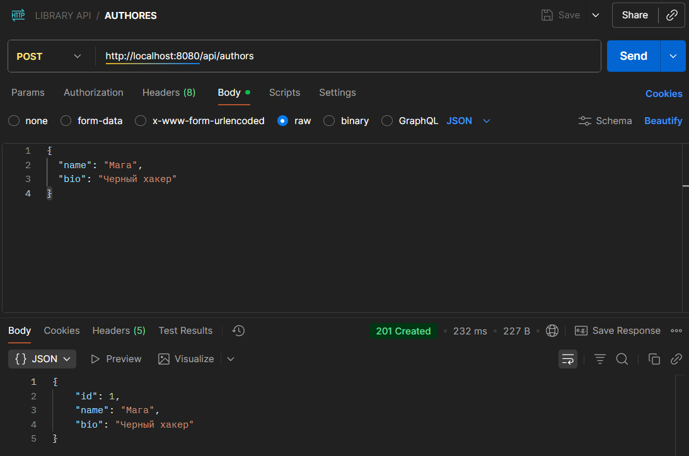
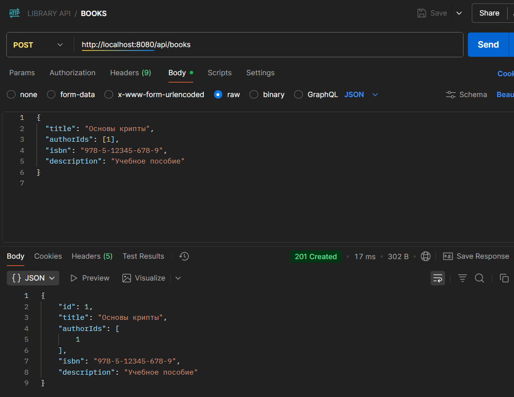
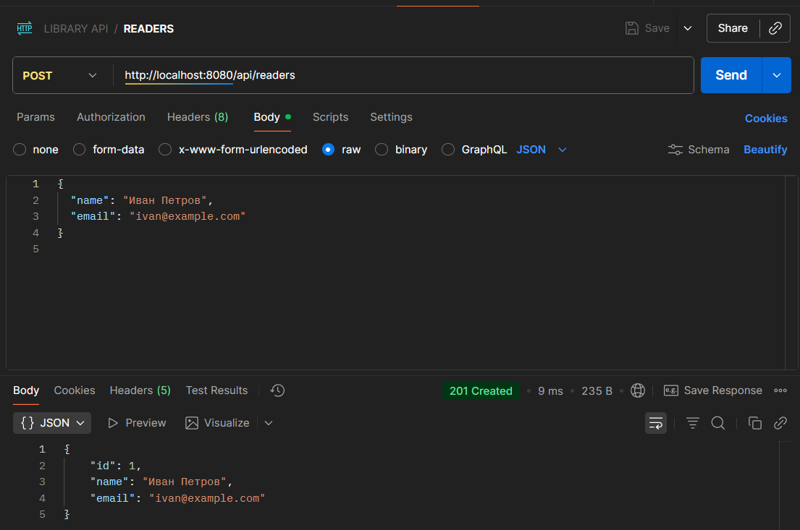
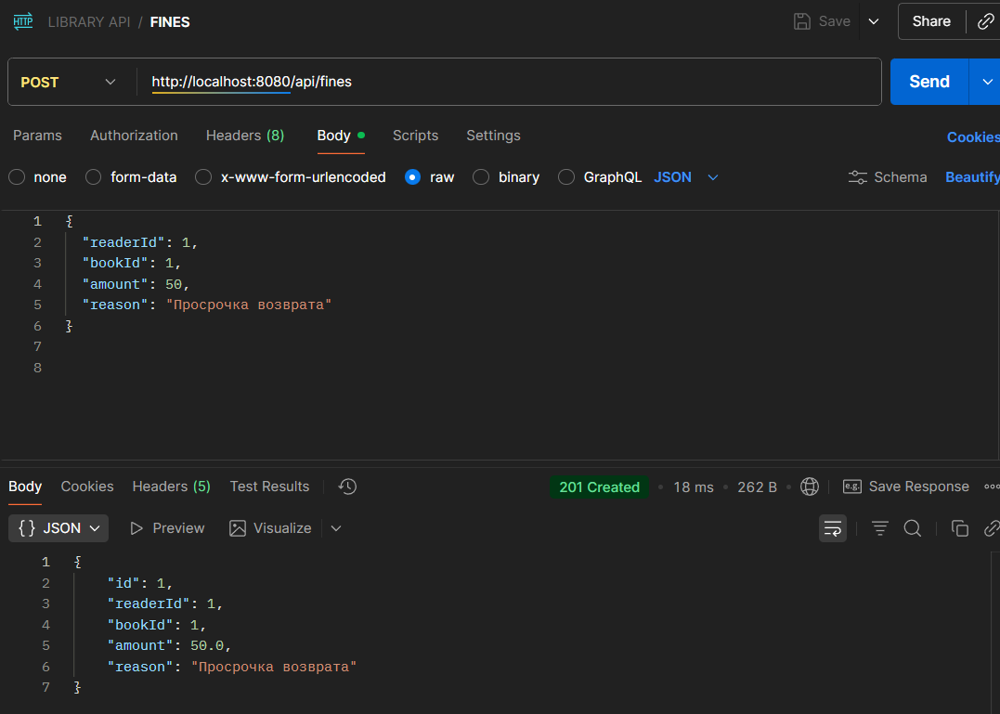

# 📚 Library API

## О проекте

Цель работы — реализовать REST‑сервис с CRUD‑операциями для сущностей **Book**, **Author**, **Reader** и **Fine**.

Я постарался сделать проект максимально воспроизводимым: от настройки зависимостей до тестирования через Postman.

---

## 🧰 Используемые технологии

- Java 21
- Spring Boot 3.5.6
- Maven
- VSCode / IntelliJ IDEA
- Postman (для тестирования API)

---

## Структура проекта

> src/main/java/com/antondemin/library_api/
> ├── LibraryApiApplication.java
> ├── model/
> │ ├── Author.java
> │ ├── Book.java
> │ ├── Reader.java
> │ └── Fine.java
> └── controller/
> ├── AuthorController.java
> ├── BookController.java
> ├── ReaderController.java
> └── FineController.java

---

## 📦 Зависимости

```xml
<dependencies>
    <dependency>
        <groupId>org.springframework.boot</groupId>
        <artifactId>spring-boot-starter</artifactId>
    </dependency>
    <dependency>
        <groupId>org.springframework.boot</groupId>
        <artifactId>spring-boot-starter-web</artifactId>
    </dependency>
    <dependency>
        <groupId>org.springframework.boot</groupId>
        <artifactId>spring-boot-starter-validation</artifactId>
    </dependency>
    <dependency>
        <groupId>org.springframework.boot</groupId>
        <artifactId>spring-boot-starter-test</artifactId>
        <scope>test</scope>
    </dependency>
</dependencies>
```

## Скриншоты работ

---


_Рис. 1. POST-запрос для сущности Author_


_Рис. 2. POST-запрос для сущности Book_


_Рис. 3. POST-запрос для сущности Readers_


_Рис. 4. POST-запрос для сущности Fines_

---

## Вывод

Реализован REST‑сервис для управления библиотекой с CRUD‑операциями для сущностей **Author**, **Book**, **Reader** и **Fine**.

_Все контроллеры протестированы через **Postman**: создание, получение, обновление и удаление работают корректно._

**В процессе работы я научился:**

> использовать аннотации _Spring Boot_ для построения **REST API** (@RestController, @PostMapping, @GetMapping и др.);

> валидировать входные данные с помощью **@NotBlank**, **@NotNull**, **@Size**;

> отлаживать ошибки 404 и 500, анализировать stacktrace и исправлять логику.

Проект получился воспроизводимым и готовым к расширению: можно подключить базу данных **(H2/Postgres)**, добавить сервисный слой и документацию Swagger/OpenAPI.

## Итог

Цель работы достигнута, сервис работает стабильно и соответствует требованиям задания.
